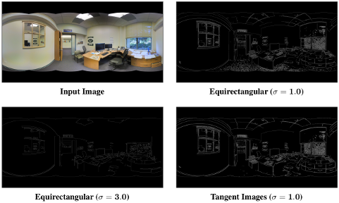
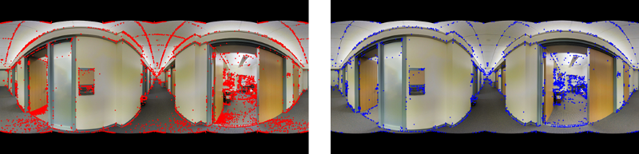

# Examples

This directory contains scripts to generate tangent images, demo some non-deep learning applications, and highlight some other functionality and analysis. These example scripts should help clarify how to use this library.

* **[canny_edge_detection.py](./canny_edge_detection.py)**: Demonstrates the low-distortion benefits of tangent images for low-level tasks (specifically Canny edge detection)

* **[compare_sift_keypoints.py](./compare_sift_keypoints.py)**: Detects SIFT keypoints on both an equirectangular image and tangent images and visualizes a comparison between them.

* **[compute_angular_resolution.py](./compute_angular_resolution.py)**: Prints the FOV and angular resolution at each base level for the provided input resolution.
* **[create_tangent_image_obj.py](./create_tangent_image_obj.py)**: Writes an OBJ file of tangent images textured with the data from an equirectangular image
* **[draw_sift_keypoints.py](./draw_sift_keypoints.py)**: Detects SIFT keypoints on both an equirectangular image and tangent images with base levels {0, 1, 2}, and draws the results with scale and orientation. Saves the outputs to PDF files.
* **[generate_tangent_images.py](./generate_tangent_images.py)**: Turns an equirectangular images into tangent image patches
* **[normalize_camera.py](./normalize_camera.py)**: Demonstrates the camera normalization used for pre-processing during the transfer learning experiments
* **[plot_icosahedron_distortion_level.py](./plot_icosahedron_distortion_level.py)**: Visualizes the distortion level at each subdivision of the regular icosahedron
* **[visualize_icosphere_sampling.py](./visualize_icosphere_sampling.py)**: Visualizes tangent images alongside the icosahedron as well as the sampling points on the sphere