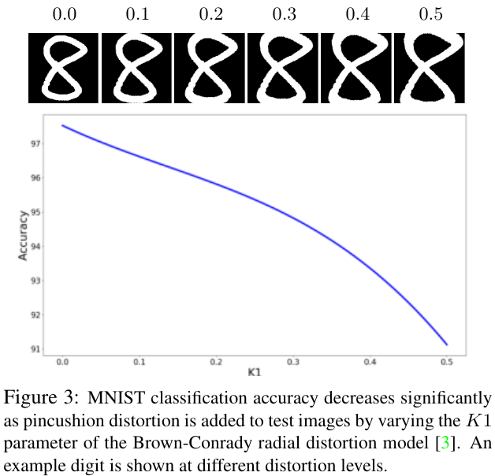

## Distorted MNIST

## Results

Adding pincushion distortion to MNIST digits reduces the accuracy of the network fairly quickly.

## Usage

To retrain the experiment, modify [train.py](train.py) to have `saved_model = None`. Otherwise, run `python train.py` to evaluate on the provided model at K1 distortion in the range [0.0, 0.5].